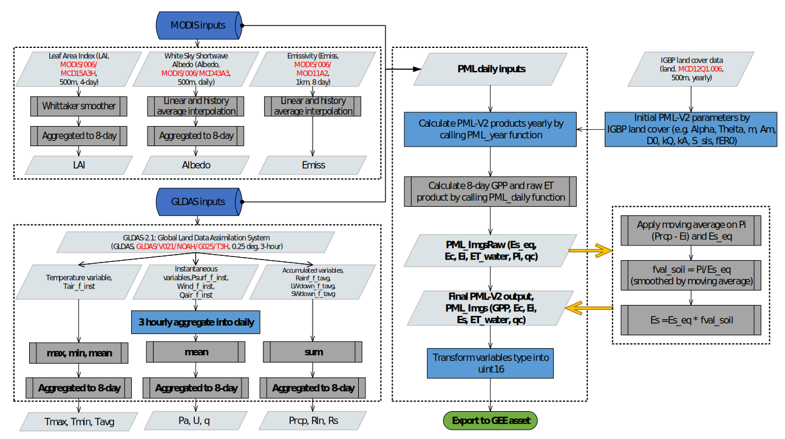

# Penman-Monteith-Leuning Evapotranspiration In Google Earth Engine

## Modeling framework

Penman-Monteith-Leuning model (abbreviated as `PML_V1`) was proposed by  *Leuning* *et al. (2008)*, and further improved by *Zhang et al., (2010, 2016)*. In PML, evaporation is divided into: transpiration from vegetation (Ec), direct evaporation from the soil (Es) and vaporization of intercepted rainfall from 
vegetation (Ei).

`PML_V2 ` was developed by *Gan et al., (2018)* and *Zhang et al., (2019)*, which coupled ET and gross primary products via canopy conductance theory. They are both in the resolution of 500 m and 8-day, and range from -60°S to 90°N.

**Figure 1**. Flowchart of global forcing data processing and `PML_V2` modeling processes. 

| Variable | Description                                                 | Unit  |
| -------- | ----------------------------------------------------------- | ----- |
| Tmax     | daily maximum temperature                                   | °C    |
| Tmin     | daily minimum temperature                                   | °C    |
| Tavg     | daily mean temperature                                      | °C    |
| Pa       | atmosphere pressure                                         | kPa   |
| U        | wind speed at 10-m height                                   | m/s   |
| q        | specific humidity                                           | kg/kg |
| Prcp     | precipitation                                               | mm/d  |
| Rln      | inward longwave solar radiation                             | W/m2  |
| Rs       | inward shortwave solar radiation                            | W/m2  |
| Pi       | the difference of Prcp and Ei                               | mm/d  |
| Es_eq    | equilibrium evaporation                                     | mm/d  |
| ET_water | evaporation from water body, snow and ice                   | mm/d  |
| qc       | quality control variable for albedo and surface emissivity. | -     |

global CO2: https://data.globalchange.gov/dataset/noaa-cmdl-co2_mm_gl

## Data product 

**Table 1**. `PML_V1` and `PML_V2 ` bands information (`PML_V1 ` have no GPP band, other
bands are some).
__*Note: Only PMLV1 is available currently.*__

| BandName | Units     | Scale    | Description|
| -------- | --------  | -------- | -------- |
|GPP       | gC m-2 d-1|  0.01  | Gross primary product|
|Ec | mm d-1 | 0.01 | Vegetation transpiration |
|Es | mm d-1 | 0.01 | Soil evaporation |
|Ei | mm d-1 | 0.01 | Interception from vegetation canopy |
|ET_water | mm d-1 | 0.01 | Water body, snow and ice evaporation. Penman  evapotranspiration is regarded as actual evaporation for them. |
|qc | - | - | Interpolation information for Albedo and Emissivity.  Bitmask for qc: **Bits 0-2**: Emissivity interpolation information  0: good value, no interpolation  1: linear interpolation   2: history 8-day average interpolation   3: history monthly average interpolation **Bits 3-5**: Albedo interpolation information   Same as Emissivity. |

### 1.1 **Access data**

Click the following links to get the access. The corresponding links are:

* PML_V1 https://code.earthengine.google.com/?asset=projects/pml_evapotranspiration/PML/OUTPUT/PML_V1_8day
* PML_V2 https://code.earthengine.google.com/?asset=projects/pml_evapotranspiration/PML/OUTPUT/PML_V2_8day_v014

### 1.2 Data download
PML products are standard `ee.ImageCollection` object in GEE.
You can clip regional data by polygon shapefile from `ee.ImageCollection`.

- Upload your polygon shapefile to GEE 
    https://developers.google.com/earth-engine/importing
- Download data from GEE   
    https://developers.google.com/earth-engine/exporting

1. For small regions, you can transform `ee.ImageCollection` into multiple bands `ee.Image`. In this way, you can download all the dataset in a time:
2. For large regions, you have to download trough `ee.ImageCollection`.

Clip and export the regional data you need by the polygon shapefile you uploaded. [This is a little example](https://code.earthengine.google.com/10ea4750eaae29097b118022fbf60a57).

## Updates

* 2019-08-02: extend the time period to 2018

## **References:** 

> [1].  Zhang, Y., Kong, D., Gan, R., Chiew, F.H.S., McVicar,
> T.R., Zhang, Q., and Yang, Y.. (2019) Coupled estimation of 500m and 8-day
> resolution global evapotranspiration and gross primary production in 2002-2017.
> Remote Sens. Environ. 222, 165-182, https://doi:10.1016/j.rse.2018.12.031 
>
> [2]. Kong, D., Zhang, Y., Gu, X., & Wang, D. (2019). A robust method for 
> reconstructing global MODIS EVI time series on the Google Earth Engine. 
> ISPRS Journal of Photogrammetry and Remote Sensing*, *155*(May), 13–24. 
> https://doi.org/10.1016/j.isprsjprs.2019.06.014
>
> [3]. Zhang, Y., Peña-Arancibia, J.L., McVicar, T.R., Chiew, F.H.S., Vaze, J.,
> Liu, C., Lu, X., Zheng, H., Wang, Y., Liu, Y.Y., Miralles, D.G., Pan, M., 2016.
> Multi-decadal trends in global terrestrial evapotranspiration and its
> components. Sci. Rep. 6, 19124. https://doi.org/10.1038/srep19124 
>
> [4]. Zhang, Y., Leuning, R., Hutley, L.B., Beringer, J., McHugh, I., Walker, J.P., 
> Using long-term water balances to parameterize surface conductances and
> calculate evaporation at 0.05°spatial resolution. Water Resour. Res. 46.
> https://doi.org/10.1029/2009WR008716  
>
> [5]. Leuning, R., Zhang, Y.Q.,
> Rajaud, A., Cleugh, H., Tu, K., 2008. A simple surface conductance model to
> estimate regional evaporation using MODIS leaf area index and the Penman-
> Monteith equation. Water Resour. Res. 44. https://doi.org/10.1029/2007WR006562
>
> [6]. Gan, R., Zhang, Y., Shi, H., Yang, Y., Eamus, D., Cheng, L., Chiew,
> F.H.S., Yu, Q., 2018. Use of satellite leaf area index estimating
> evapotranspiration and gross assimilation for Australian ecosystems.
> Ecohydrology. e1974. https://doi.org/10.1002/eco.1974
>
> [7]. Gorelick, N., Hancher, M., Dixon, M., Ilyushchenko, S., Thau, D., Moore,
> R., 2017. Google Earth Engine: Planetary-scale geospatial analysis for
> everyone. Remote Sens. Environ. 202, 18–27.
> https://doi.org/10.1016/j.rse.2017.06.031

## Acknowledgements

Keep in mind that this repository is released under a GPL2 license, which
permits commercial use but requires that the source code (of derivatives) is
always open even if hosted as a web service.
